# Databricks Account Monitor

**Track consumption, forecast contract exhaustion, and manage Databricks spending**

[](https://databricks.com)
[](CHANGELOG.md)

---

## Overview

The Account Monitor is a complete solution for tracking Databricks consumption and predicting when contracts will be exhausted. It combines:

- **Real-time cost tracking** from Databricks system tables
- **ML-based forecasting** using Prophet to predict future consumption
- **Contract burndown visualization** showing historical spend and projected exhaustion dates
- **Automated refresh jobs** to keep data current

### Key Capabilities

| Feature | Description |
|---------|-------------|
| **Cost Monitoring** | Track spending across all workspaces, SKUs, and products |
| **Contract Management** | Store contract details (value, dates, cloud provider) |
| **Burndown Analysis** | Visualize cumulative spend vs contract limit |
| **ML Forecasting** | Prophet-based predictions with exhaustion dates |
| **Automated Jobs** | Daily refresh, weekly training, monthly summaries |

---

## Architecture


---

## Data Model


### System Tables (Read-Only)

| Table | Description |
|-------|-------------|
| `system.billing.usage` | Raw usage records (DBUs, dates, workspaces, SKUs) |
| `system.billing.list_prices` | Pricing information per SKU and cloud |

---

## Job Schedule


| Job | Schedule | Purpose | Manual Command |
|-----|----------|---------|----------------|
| **Daily Refresh** | 2:00 AM UTC | Update consumption data | `databricks bundle run account_monitor_daily_refresh` |
| **Weekly Training** | Sunday 3:00 AM | Retrain Prophet models | `databricks bundle run account_monitor_weekly_training` |
| **Weekly Review** | Monday 8:00 AM | Contract analysis | `databricks bundle run account_monitor_weekly_review` |
| **Monthly Summary** | 1st @ 6:00 AM | Archive & reports | `databricks bundle run account_monitor_monthly_summary` |

---

## Setup

### Prerequisites

- Databricks workspace with **Unity Catalog** enabled
- Access to **system.billing** tables (account admin or granted access)
- **Databricks CLI** installed and configured
- A **SQL Warehouse** (serverless recommended)

### Step 1: Configure the Bundle

Edit `databricks.yml` with your settings:

```yaml
targets:
  dev:
    workspace:
      host: https://your-workspace.cloud.databricks.com
    variables:
      warehouse_id: "your-warehouse-id"   # From SQL Warehouses page
      catalog: "main"
      schema: "account_monitoring_dev"
```

### Step 2: Deploy

```bash
# Authenticate
databricks auth login --host https://your-workspace.cloud.databricks.com --profile YOUR_PROFILE

# Deploy all resources
databricks bundle deploy --profile YOUR_PROFILE

# Run setup to create tables
databricks bundle run account_monitor_setup --profile YOUR_PROFILE
```

### Step 3: Add Your Contract Data

Open the **Contract Management CRUD** notebook and add your actual contract:

```sql
-- Example: Add a contract
MERGE INTO main.account_monitoring_dev.contracts AS target
USING (SELECT
  'CONTRACT-2026-001' as contract_id,
  'your-databricks-account-id' as account_id,
  'AWS' as cloud_provider,
  DATE '2025-07-01' as start_date,
  DATE '2026-06-30' as end_date,
  50000.00 as total_value,
  'USD' as currency,
  'SPEND' as commitment_type,
  'ACTIVE' as status,
  'Annual enterprise contract' as notes
) AS source
ON target.contract_id = source.contract_id
WHEN MATCHED THEN UPDATE SET *
WHEN NOT MATCHED THEN INSERT *;
```

---

## Visualizations

### Contract Burndown Chart

The burndown chart shows cumulative spending over time compared to the contract limit:

```mermaid
%%{init: {'theme': 'base', 'themeVariables': { 'primaryColor': '#ff6b6b', 'secondaryColor': '#ffd93d'}}}%%
flowchart LR
    subgraph chart["📈 Contract Burndown Chart"]
        direction TB

        subgraph historical["Historical Spend (Yellow)"]
            h1["Jul: $5K"]
            h2["Aug: $10K"]
            h3["Sep: $15K"]
            h4["Oct: $20K"]
            h5["Nov: $25K"]
            h6["Dec: $30K"]
        end

        subgraph forecast["ML Forecast (Red)"]
            f1["Jan: $38K"]
            f2["Feb: $47K"]
            f3["Mar: $55K ❌"]
        end

        limit["━━━ Contract Limit: $50K ━━━"]
    end

    h6 --> f1
    f2 -.->|"Crosses Limit"| limit
```



**Chart Legend:**
| Element | Color | Description |
|---------|-------|-------------|
| Historical Spend | 🟡 Yellow | Actual cumulative spending to date |
| ML Forecast | 🔴 Red | Prophet-predicted future spending |
| Contract Limit | ⬛ Dashed | Contract commitment amount ($50,000) |
| ❌ Intersection | | Where forecast crosses limit = **exhaustion date** |

### Exhaustion Prediction

```mermaid
flowchart LR
    subgraph current["📊 Current State"]
        spent["$30,000 Spent"]
        rate["$166/day avg"]
    end

    subgraph prediction["🔮 ML Prediction"]
        exhaust["Exhaustion: Jan 30, 2026"]
        conf["Confidence: 80%"]
    end

    subgraph action["⚠️ Action Required"]
        alert["120 days remaining"]
    end

    current --> prediction --> action
```



**Forecast Summary Output:**
```
============================================================
FORECAST SUMMARY
============================================================
Contract ID: CONTRACT-2026-001
Contract Value: $50,000.00
Current Spend: $30,000.00
Model: prophet
Predicted Exhaustion Date: 2026-01-30
Days Remaining: 120
============================================================
```

---

## Verifying Data Freshness

```sql
-- Check data freshness
SELECT
  'contract_burndown' as table_name,
  MAX(usage_date) as latest_data,
  DATEDIFF(CURRENT_DATE(), MAX(usage_date)) as days_stale
FROM main.account_monitoring_dev.contract_burndown

UNION ALL

SELECT
  'contract_forecast' as table_name,
  MAX(forecast_date) as latest_data,
  DATEDIFF(CURRENT_DATE(), MAX(created_at)) as days_stale
FROM main.account_monitoring_dev.contract_forecast;
```

**Expected Results:**
- `contract_burndown.latest_data` should be yesterday or today
- `contract_forecast` should be updated within the last 7 days

---

## Notebooks

| Notebook | Purpose |
|----------|---------|
| **account_monitor_notebook.py** | Main dashboard with all visualizations |
| **contract_management_crud.py** | Add, update, delete contracts and metadata |
| **consumption_forecaster.py** | Prophet model training and inference |
| **post_deployment_validation.py** | Verify setup and data integrity |

### Opening the Dashboard

1. Navigate to your Databricks workspace
2. Go to **Workspace** > **Users** > **your-email** > **account_monitor** > **files** > **notebooks**
3. Open **account_monitor_notebook**
4. Click **Run All** to see all visualizations

---

## Troubleshooting


### Common Commands

```bash
# Check system tables have data
databricks sql -e "SELECT COUNT(*) FROM system.billing.usage WHERE usage_date >= DATE_SUB(CURRENT_DATE(), 30)"

# Run the daily refresh
databricks bundle run account_monitor_daily_refresh --profile YOUR_PROFILE

# Run forecast training
databricks bundle run account_monitor_weekly_training --profile YOUR_PROFILE

# Check job run status
databricks runs get --run-id <RUN_ID> --profile YOUR_PROFILE
```

---

## File Structure

```mermaid
flowchart LR
    subgraph root["📁 Root"]
        readme["README.md"]
        config["databricks.yml"]
    end

    subgraph notebooks["📓 notebooks/"]
        monitor["account_monitor_notebook.py"]
        crud["contract_management_crud.py"]
        forecast["consumption_forecaster.py"]
    end

    subgraph sql["🗃️ sql/"]
        setup["setup_schema.sql"]
        refresh["refresh_*.sql"]
    end

    subgraph resources["⚙️ resources/"]
        jobs["jobs.yml"]
    end

    root --> notebooks
    root --> sql
    root --> resources
```



```
databricks_conso_reports/
├── databricks.yml              # Bundle configuration
├── README.md                   # This file
├── notebooks/
│   ├── account_monitor_notebook.py    # Main dashboard
│   ├── contract_management_crud.py    # CRUD operations
│   ├── consumption_forecaster.py      # ML forecasting
│   └── post_deployment_validation.py  # Setup verification
├── sql/
│   ├── setup_schema.sql               # Create all tables
│   ├── refresh_dashboard_data.sql     # Daily data refresh
│   ├── refresh_contract_burndown.sql  # Burndown calculation
│   └── build_forecast_features.sql    # ML feature prep
├── resources/
│   └── jobs.yml                       # Job definitions
└── docs/
    └── user-guide/
        └── USER_GUIDE.md              # Detailed documentation
```

---

## Version History

| Version | Date | Changes |
|---------|------|---------|
| **1.7.0** | 2026-02-05 | Added Prophet ML forecasting, exhaustion predictions |
| **1.6.1** | 2026-02-04 | Removed salesforce_id, added notes column |
| **1.5.0** | 2026-02-01 | Initial stable release |

---

## Quick Reference

```bash
# Deploy everything
databricks bundle deploy --profile YOUR_PROFILE

# Run setup (first time only)
databricks bundle run account_monitor_setup --profile YOUR_PROFILE

# Refresh data now
databricks bundle run account_monitor_daily_refresh --profile YOUR_PROFILE

# Train forecast models
databricks bundle run account_monitor_weekly_training --profile YOUR_PROFILE

# Check job status
databricks jobs list --profile YOUR_PROFILE
```

---

**Need more details?** See the [Complete User Guide](docs/user-guide/USER_GUIDE.md)
