# Databricks Account Monitor

**Track consumption, forecast contract exhaustion, and manage Databricks spending**

[](https://databricks.com)
[](CHANGELOG.md)

---

## Overview

The Account Monitor is a complete solution for tracking Databricks consumption and predicting when contracts will be exhausted. It combines:

- **Real-time cost tracking** from Databricks system tables
- **ML-based forecasting** using Prophet to predict future consumption
- **Contract burndown visualization** showing historical spend and projected exhaustion dates
- **Automated refresh jobs** to keep data current

### Key Capabilities

| Feature | Description |
|---------|-------------|
| **Cost Monitoring** | Track spending across all workspaces, SKUs, and products |
| **Contract Management** | Store contract details (value, dates, cloud provider) |
| **Burndown Analysis** | Visualize cumulative spend vs contract limit |
| **ML Forecasting** | Prophet-based predictions with exhaustion dates |
| **What-If Analysis** | Discount scenario simulation with savings projections |
| **Automated Jobs** | Daily refresh, weekly training, monthly summaries |

---

## Quick Start - First Install

### One-Command Install

```bash
# 1. Configure your contracts
vi config/contracts.yml

# 2. Deploy the bundle
databricks bundle deploy --profile YOUR_PROFILE

# 3. Run the first install job (does everything)
databricks bundle run account_monitor_first_install --profile YOUR_PROFILE
```

This single job creates tables, loads contracts, populates data, and trains the ML model.

### Manual Step-by-Step (Alternative)

Complete setup in 5 steps. After this, you'll have a working dashboard with ML forecasts.

```mermaid
flowchart LR
    subgraph step1["1️⃣ Configure"]
        config["Edit contracts.yml"]
    end

    subgraph step2["2️⃣ Deploy"]
        deploy["databricks bundle deploy"]
    end

    subgraph step3["3️⃣ Setup"]
        setup["Run setup job"]
    end

    subgraph step4["4️⃣ Load Data"]
        refresh["Run daily refresh"]
    end

    subgraph step5["5️⃣ Train Model"]
        train["Run weekly training"]
    end

    subgraph done["✅ Ready"]
        dashboard["Open Dashboard"]
    end

    step1 --> step2 --> step3 --> step4 --> step5 --> done
```



### Step 1: Configure Your Contracts

Edit `config/contracts.yml` with your contract details:

```yaml
account_metadata:
  account_id: "auto"                    # Auto-detect from billing
  customer_name: "Your Organization"

contracts:
  - contract_id: "MY-CONTRACT-001"
    cloud_provider: "auto"              # Auto-detect (AWS/Azure/GCP)
    start_date: "auto"                  # Or specific date: "2025-01-01"
    end_date: "auto"                    # Or specific date: "2025-12-31"
    total_value: 50000.00               # Your contract commitment
    currency: "USD"
    commitment_type: "SPEND"
    status: "ACTIVE"
    notes: "Annual contract"
```

### Step 2: Deploy the Bundle

```bash
# Set your profile (replace with your actual profile name)
export PROFILE="YOUR_PROFILE"

# Deploy all resources to Databricks
databricks bundle deploy --profile $PROFILE

# If dashboard was modified in UI, use --force to overwrite
databricks bundle deploy --profile $PROFILE --force
```

### Step 3: Run Initial Setup

This creates tables and loads your contracts from the config file:

```bash
databricks bundle run account_monitor_setup --profile $PROFILE
```

**Expected output:** Schema created, contracts loaded from `contracts.yml`

### Step 4: Load Historical Data

Run the daily refresh to populate burndown data from `system.billing.usage`:

```bash
databricks bundle run account_monitor_daily_refresh --profile $PROFILE
```

**Expected output:** `dashboard_data` and `contract_burndown` tables populated

### Step 5: Train the Forecast Model

Run the weekly training job to generate ML predictions:

```bash
databricks bundle run account_monitor_weekly_training --profile $PROFILE
```

**Expected output:** Prophet model trained, `contract_forecast` table populated with exhaustion dates

### Step 6: View the Dashboard

The Lakeview dashboard is automatically deployed. Open it from:
1. **Databricks Workspace** > **Dashboards** > **Contract Consumption Monitor**

Or use the CLI:
```bash
databricks lakeview list --profile YOUR_PROFILE
```

**Dashboard Pages:**
| Page | Description |
|------|-------------|
| **Executive Summary** | Contract overview, pace status, total consumption |
| **Contract Burndown** | Cumulative spend vs commitment with ML forecast |
| **What-If Analysis** | Discount scenario comparison and savings projections |

---

## Architecture


---

## Data Model


### System Tables (Read-Only)

| Table | Description |
|-------|-------------|
| `system.billing.usage` | Raw usage records (DBUs, dates, workspaces, SKUs) |
| `system.billing.list_prices` | Pricing information per SKU and cloud |

---

## Job Schedule


| Job | Schedule | Purpose | Manual Command |
|-----|----------|---------|----------------|
| **Daily Refresh** | 2:00 AM UTC | Update consumption data | `databricks bundle run account_monitor_daily_refresh` |
| **Weekly Training** | Sunday 3:00 AM | Retrain Prophet models | `databricks bundle run account_monitor_weekly_training` |
| **Weekly Review** | Monday 8:00 AM | Contract analysis | `databricks bundle run account_monitor_weekly_review` |
| **Monthly Summary** | 1st @ 6:00 AM | Archive & reports | `databricks bundle run account_monitor_monthly_summary` |

---

## Setup

### Prerequisites

- Databricks workspace with **Unity Catalog** enabled
- Access to **system.billing** tables (account admin or granted access)
- **Databricks CLI** installed and configured
- A **SQL Warehouse** (serverless recommended)

### Step 1: Configure the Bundle

Edit `databricks.yml` with your workspace settings:

```yaml
targets:
  dev:
    workspace:
      host: https://your-workspace.cloud.databricks.com
    variables:
      warehouse_id: "your-warehouse-id"   # From SQL Warehouses page
      catalog: "main"
      schema: "account_monitoring_dev"
```

### Step 2: Configure Your Contracts

Edit `config/contracts.yml` to define your organization and contracts:

```yaml
# config/contracts.yml
account_metadata:
  account_id: "auto"                    # Auto-detect from billing data
  customer_name: "Your Organization"
  business_unit_l0: "AMER"
  account_executive: "John Doe"
  solutions_architect: "Jane Smith"
  region: "US-WEST"
  industry: "Technology"

contracts:
  - contract_id: "CONTRACT-2026-001"
    cloud_provider: "auto"              # Auto-detect (AWS/Azure/GCP)
    start_date: "2025-07-01"            # Or "auto" for 1 year ago
    end_date: "2026-06-30"              # Or "auto" for 1 year from now
    total_value: 50000.00
    currency: "USD"
    commitment_type: "SPEND"
    status: "ACTIVE"
    notes: "Annual enterprise contract"

  # Add more contracts as needed:
  - contract_id: "CONTRACT-2026-002"
    cloud_provider: "AWS"
    start_date: "2026-01-01"
    end_date: "2026-12-31"
    total_value: 100000.00
    currency: "USD"
    commitment_type: "DBU"
    status: "PENDING"
    notes: "DBU commitment for next year"
```

**Auto-detection:**
- `account_id: "auto"` → Reads from `system.billing.usage`
- `cloud_provider: "auto"` → Detects from your actual usage data
- `start_date: "auto"` → Sets to 1 year ago
- `end_date: "auto"` → Sets to 1 year from now

**Multiple Config Files:**

You can load contracts from multiple YAML files by setting the `config_files` variable:

```yaml
# In databricks.yml - set for a specific target
targets:
  dev:
    variables:
      config_files: "config/contracts.yml,config/contracts_customer_b.yml"
```

Or pass at runtime:
```bash
databricks bundle run account_monitor_first_install \
  --param config_files="config/contracts.yml,config/contracts_customer_b.yml"
```

See `config/contracts_example.yml` for a template.

### Step 3: Deploy and Setup

```bash
# Authenticate
databricks auth login --host https://your-workspace.cloud.databricks.com --profile YOUR_PROFILE

# Deploy all resources
databricks bundle deploy --profile YOUR_PROFILE

# Run setup (creates tables + loads contracts from config)
databricks bundle run account_monitor_setup --profile YOUR_PROFILE
```

### Updating Contracts Later

To add or modify contracts after initial setup:

1. Edit `config/contracts.yml`
2. Redeploy: `databricks bundle deploy --profile YOUR_PROFILE`
3. Re-run setup: `databricks bundle run account_monitor_setup --profile YOUR_PROFILE`

Or use the **Contract Management CRUD** notebook for manual changes

---

## Visualizations

### Contract Burndown Chart (Lakeview Dashboard)

The Lakeview dashboard **Contract Burndown** page shows cumulative spending with ML forecasts:

**Prophet ML Forecast Chart:**
| Series | Color | Description |
|--------|-------|-------------|
| **Historical Consumption** | Gold (#FFD700) | Actual cumulative spending to date |
| **ML Forecast (Prophet)** | Red (#FF0000) | Prophet-predicted future spending |
| **Contract Commitment** | Dark Blue (#00008B) | Horizontal line at contract limit |
| **Exhaustion: \<date\>** | White | Vertical line marking predicted exhaustion date |

The exhaustion date line shows exactly when the forecast crosses the contract commitment, with the date displayed in the legend (e.g., "Exhaustion: Jul 29, 2026").

**Contract Burndown Page Widgets:**
1. Contract Burndown - Actual Consumption Over Time
2. Contract Burndown with Prophet ML Forecast (with exhaustion line)
3. Contract Details & Status (Start Date, End Date, Value, Consumed, etc.)
4. Contract Exhaustion Prediction (Predicted Date, Days Until, Status)

### Exhaustion Prediction

```mermaid
flowchart LR
    subgraph current["📊 Current State"]
        spent["$30,000 Spent"]
        rate["$166/day avg"]
    end

    subgraph prediction["🔮 ML Prediction"]
        exhaust["Exhaustion: Jan 30, 2026"]
        conf["Confidence: 80%"]
    end

    subgraph action["⚠️ Action Required"]
        alert["120 days remaining"]
    end

    current --> prediction --> action
```



**Forecast Summary Output:**
```
============================================================
FORECAST SUMMARY
============================================================
Contract ID: CONTRACT-2026-001
Contract Value: $50,000.00
Current Spend: $30,000.00
Model: prophet
Predicted Exhaustion Date: 2026-01-30
Days Remaining: 120
============================================================
```

---

## What-If Discount Simulation

The What-If simulator helps you understand how different discount levels could impact your contract consumption and extend your contract runway.

### Objectives

1. **Scenario Comparison**: Generate multiple discount scenarios (0%, 5%, 10%, 15%, 20%+) to compare savings
2. **Duration Incentives**: Show how longer contract commitments unlock higher discount rates
3. **Sweet Spot Detection**: Identify the optimal discount level based on your consumption patterns
4. **Break-Even Analysis**: Determine minimum consumption needed to justify each discount tier
5. **Exhaustion Extension**: Calculate how many additional days each discount level provides

### How It Works

```mermaid
flowchart LR
    subgraph input["📊 Inputs"]
        burndown["Contract Burndown"]
        forecast["Prophet Forecast"]
        tiers["Discount Tiers"]
    end

    subgraph simulate["🧮 Simulator"]
        scenarios["Generate Scenarios"]
        scale["Apply Discount Factor"]
        predict["Project Exhaustion"]
    end

    subgraph output["📈 Outputs"]
        comparison["Scenario Comparison"]
        sweet["Sweet Spot"]
        savings["Savings Analysis"]
    end

    input --> simulate --> output
```



The simulator:
1. Reads your historical consumption from `contract_burndown`
2. Loads Prophet forecasts from `contract_forecast`
3. Looks up maximum discount rates from `discount_tiers` based on commitment value and duration
4. Generates scenarios at each discount level (capped by tier max)
5. Calculates simulated burndown with discount applied
6. Projects new exhaustion dates for each scenario
7. Identifies the "sweet spot" (highest savings with ≥85% utilization)

### Discount Tier Configuration

Default discount tiers are based on commitment level and contract duration:

| Commitment | 1-Year | 2-Year | 3-Year |
|------------|--------|--------|--------|
| $50K - $100K | 5% | 8% | 10% |
| $100K - $250K | 10% | 15% | 18% |
| $250K - $500K | 15% | 20% | 25% |
| $500K - $1M | 20% | 25% | 30% |
| $1M - $5M | 25% | 30% | 35% |
| $5M+ | 30% | 35% | 40% |

**Customizing Tiers:**

Edit `config/discount_tiers.yml` to customize discount rates for your organization:

```yaml
# config/discount_tiers.yml
discount_tiers:
  # Custom tier example
  - tier_id: "CUSTOM_150K_1Y"
    tier_name: "Custom - 1 Year"
    min_commitment: 150000
    max_commitment: 200000
    duration_years: 1
    discount_rate: 0.12          # 12% discount
    notes: "Negotiated rate for strategic accounts"

  # Add more tiers as needed...
  - tier_id: "CUSTOM_150K_2Y"
    tier_name: "Custom - 2 Year"
    min_commitment: 150000
    max_commitment: 200000
    duration_years: 2
    discount_rate: 0.18
    notes: "2-year commitment bonus"
```

**Tier Fields:**
| Field | Required | Description |
|-------|----------|-------------|
| `tier_id` | Yes | Unique identifier (e.g., "TIER_100K_2Y") |
| `tier_name` | Yes | Human-readable name |
| `min_commitment` | Yes | Minimum contract value for this tier |
| `max_commitment` | No | Maximum contract value (null = unlimited) |
| `duration_years` | Yes | Contract duration (1, 2, or 3) |
| `discount_rate` | Yes | Discount as decimal (0.15 = 15%) |
| `cloud_provider` | No | Restrict to specific cloud (null = all) |
| `effective_date` | No | When tier becomes active |
| `expiration_date` | No | When tier expires |
| `notes` | No | Optional description |

After editing, redeploy and rerun the setup job:

```bash
databricks bundle deploy --profile YOUR_PROFILE
databricks bundle run account_monitor_setup --profile YOUR_PROFILE
```

### Example What-If Results

For a **$100,000 contract** with **1-year duration**, the simulator generates:

| Scenario | Discount | Savings to Date | Exhaustion Date | Days Extended |
|----------|----------|-----------------|-----------------|---------------|
| Baseline (No Discount) | 0% | $0 | Jul 29, 2026 | - |
| 5% Discount | 5% | $2,145 | Aug 18, 2026 | +20 |
| 10% Discount (Max for 1yr) | 10% | $4,290 | Sep 8, 2026 | +41 |
| **15% (If 2yr commit)** | 15% | $6,435 | Sep 29, 2026 | +62 |
| **18% (If 3yr commit)** | 18% | $7,722 | Oct 13, 2026 | +76 |

**Reading the results:**
- **Baseline**: Current consumption without discount
- **Regular scenarios**: What you can achieve with your current contract duration
- **"If Xyr commit" scenarios**: Potential savings if you extend to a longer contract term

### Sweet Spot Recommendation

The simulator automatically identifies the **sweet spot** - the discount level that provides maximum savings while maintaining healthy utilization (≥85%):

```
Sweet Spot Recommendation:
┌─────────────────┬────────────────────────────┬───────────┬──────────┐
│ Contract        │ Recommended Scenario       │ Savings   │ Days +   │
├─────────────────┼────────────────────────────┼───────────┼──────────┤
│ CONTRACT-2026   │ 10% Discount (Max for 1yr) │ $4,290    │ +41      │
└─────────────────┴────────────────────────────┴───────────┴──────────┘
```

### Dashboard - What-If Analysis Page

The Lakeview dashboard includes a **What-If Analysis** page with:

| Widget | Description |
|--------|-------------|
| **What-If Burndown Chart** | Multi-line chart comparing baseline vs extension scenarios |
| **Sweet Spot Summary** | Recommended scenario per contract |
| **Strategy & Savings Explained** | Dynamic business summary with live contract data |

**Strategy & Savings Explained Widget** shows 6 lines of live data:

| Line | Content |
|------|---------|
| 📋 CONTRACT | Total commitment amount |
| 📅 CURRENT TERM | Exact start/end dates with days remaining |
| 📈 CONSUMED | Amount spent, % utilized, remaining budget |
| ⚠️ STATUS | Exhaustion prediction or warning |
| 💡 EXTENSION | Extension option with new end date and discount % |
| 💰 SAVINGS | Total potential savings with extension |

### What-If Tables

| Table | Purpose |
|-------|---------|
| `discount_tiers` | Configurable discount rates by commitment and duration |
| `discount_scenarios` | Generated scenarios for each contract |
| `scenario_burndown` | Simulated daily consumption with discount applied |
| `scenario_forecast` | Scaled Prophet predictions for each scenario |
| `scenario_summary` | Denormalized KPIs for dashboard queries |

### Running What-If Simulation

The What-If simulation runs automatically as part of:
- **First Install**: After Prophet training completes
- **Weekly Training**: After model retraining

To run manually:

```bash
# Run the full simulator notebook
databricks bundle run account_monitor_weekly_training --profile YOUR_PROFILE

# Or just refresh scenarios (SQL-only, uses existing data)
databricks workspace import-file sql/refresh_whatif_scenarios.sql /tmp/refresh.sql --profile YOUR_PROFILE
databricks sql execute --file /tmp/refresh.sql --profile YOUR_PROFILE
```

---

## Verifying Data Freshness

```sql
-- Check data freshness
SELECT
  'contract_burndown' as table_name,
  MAX(usage_date) as latest_data,
  DATEDIFF(CURRENT_DATE(), MAX(usage_date)) as days_stale
FROM main.account_monitoring_dev.contract_burndown

UNION ALL

SELECT
  'contract_forecast' as table_name,
  MAX(forecast_date) as latest_data,
  DATEDIFF(CURRENT_DATE(), MAX(created_at)) as days_stale
FROM main.account_monitoring_dev.contract_forecast;
```

**Expected Results:**
- `contract_burndown.latest_data` should be yesterday or today
- `contract_forecast` should be updated within the last 7 days

---

## Notebooks

| Notebook | Purpose |
|----------|---------|
| **account_monitor_notebook.py** | Main dashboard with all visualizations |
| **contract_management_crud.py** | Add, update, delete contracts and metadata |
| **consumption_forecaster.py** | Prophet model training and inference |
| **whatif_simulator.py** | What-If discount scenario generation |
| **post_deployment_validation.py** | Verify setup and data integrity |

### Opening the Dashboard

**Lakeview Dashboard (recommended):**
1. Navigate to **Dashboards** in your Databricks workspace
2. Open **Contract Consumption Monitor**

**Notebook (alternative):**
1. Go to **Workspace** > **Users** > **your-email** > **account_monitor** > **files** > **notebooks**
2. Open **account_monitor_notebook** and click **Run All**

---

## Troubleshooting


### Common Commands

```bash
# Check system tables have data
databricks sql -e "SELECT COUNT(*) FROM system.billing.usage WHERE usage_date >= DATE_SUB(CURRENT_DATE(), 30)"

# Run the daily refresh
databricks bundle run account_monitor_daily_refresh --profile YOUR_PROFILE

# Run forecast training
databricks bundle run account_monitor_weekly_training --profile YOUR_PROFILE

# Check job run status
databricks runs get --run-id <RUN_ID> --profile YOUR_PROFILE
```

---

## Administrator Operations Guide

This section is for administrators responsible for maintaining the Account Monitor system in production.

### System Health Overview

```mermaid
flowchart TB
    subgraph monitoring["📊 Health Monitoring"]
        jobs["Job Status"]
        data["Data Freshness"]
        forecast["Forecast Validity"]
    end

    subgraph daily["⏰ Daily Checks"]
        d1["Check job runs"]
        d2["Verify data freshness"]
        d3["Review anomalies"]
    end

    subgraph weekly["📅 Weekly Tasks"]
        w1["Retrain ML model"]
        w2["Review forecast accuracy"]
        w3["Update contracts"]
    end

    subgraph monthly["📆 Monthly Tasks"]
        m1["Archive old data"]
        m2["Optimize tables"]
        m3["Review access"]
    end

    monitoring --> daily
    daily --> weekly
    weekly --> monthly
```



### Daily Operations Checklist

| Task | Command / Query | Expected Result |
|------|-----------------|-----------------|
| Verify daily job ran | `databricks runs list --job-id <job_id> --limit 1` | Completed status |
| Check data freshness | See query below | ≤ 2 days behind |
| Review consumption anomalies | Dashboard Executive Summary | No unexpected spikes |

**Data Freshness Check:**
```sql
-- Run this daily to verify data pipeline health
SELECT
  'contract_burndown' as table_name,
  MAX(usage_date) as latest_data,
  DATEDIFF(CURRENT_DATE(), MAX(usage_date)) as days_stale,
  CASE
    WHEN DATEDIFF(CURRENT_DATE(), MAX(usage_date)) <= 2 THEN 'OK'
    WHEN DATEDIFF(CURRENT_DATE(), MAX(usage_date)) <= 5 THEN 'WARNING'
    ELSE 'CRITICAL'
  END as status
FROM main.account_monitoring_dev.contract_burndown

UNION ALL

SELECT
  'contract_forecast' as table_name,
  MAX(forecast_date) as latest_data,
  DATEDIFF(CURRENT_DATE(), MAX(created_at)) as days_stale,
  CASE
    WHEN DATEDIFF(CURRENT_DATE(), MAX(created_at)) <= 7 THEN 'OK'
    WHEN DATEDIFF(CURRENT_DATE(), MAX(created_at)) <= 14 THEN 'WARNING'
    ELSE 'CRITICAL - Retrain needed'
  END as status
FROM main.account_monitoring_dev.contract_forecast

UNION ALL

SELECT
  'scenario_summary' as table_name,
  MAX(last_calculated) as latest_data,
  DATEDIFF(CURRENT_DATE(), MAX(last_calculated)) as days_stale,
  CASE
    WHEN DATEDIFF(CURRENT_DATE(), MAX(last_calculated)) <= 7 THEN 'OK'
    ELSE 'WARNING - Re-run What-If'
  END as status
FROM main.account_monitoring_dev.scenario_summary;
```

### Weekly Operations Checklist

| Task | When | Command |
|------|------|---------|
| Retrain Prophet model | Sunday 3 AM (auto) | `databricks bundle run account_monitor_weekly_training` |
| Verify forecast accuracy | Monday morning | Check dashboard predictions vs actuals |
| Review contract pace | Monday morning | Dashboard Contract Burndown page |
| Check expiring contracts | Any day | See query below |

**Contracts Expiring Soon:**
```sql
SELECT
  contract_id,
  total_value,
  end_date,
  DATEDIFF(end_date, CURRENT_DATE()) as days_remaining,
  CASE
    WHEN DATEDIFF(end_date, CURRENT_DATE()) <= 30 THEN 'URGENT'
    WHEN DATEDIFF(end_date, CURRENT_DATE()) <= 60 THEN 'SOON'
    WHEN DATEDIFF(end_date, CURRENT_DATE()) <= 90 THEN 'UPCOMING'
    ELSE 'OK'
  END as urgency
FROM main.account_monitoring_dev.contracts
WHERE status = 'ACTIVE'
  AND DATEDIFF(end_date, CURRENT_DATE()) <= 90
ORDER BY end_date;
```

### Monthly Operations Checklist

| Task | When | Purpose |
|------|------|---------|
| Optimize Delta tables | 1st of month | Improve query performance |
| Archive old data | 1st of month | Manage storage costs |
| Review discount tiers | 1st of month | Update if rates changed |
| Validate ML model drift | 1st of month | Ensure forecasts are accurate |

**Table Optimization:**
```sql
-- Run monthly to maintain performance
OPTIMIZE main.account_monitoring_dev.contract_burndown ZORDER BY (contract_id, usage_date);
OPTIMIZE main.account_monitoring_dev.dashboard_data ZORDER BY (usage_date, workspace_id);
OPTIMIZE main.account_monitoring_dev.contract_forecast ZORDER BY (contract_id, forecast_date);

-- Vacuum old versions (after 7 days retention)
VACUUM main.account_monitoring_dev.contract_burndown RETAIN 168 HOURS;
VACUUM main.account_monitoring_dev.dashboard_data RETAIN 168 HOURS;
```

### Job Monitoring

**Check Job Run History:**
```bash
# List recent job runs
databricks runs list --job-id <job_id> --limit 10 --profile YOUR_PROFILE

# Get details of a specific run
databricks runs get --run-id <run_id> --profile YOUR_PROFILE

# List all account monitor jobs
databricks jobs list --profile YOUR_PROFILE | grep account_monitor
```

**Job Health Query:**
```sql
-- Check if scheduled jobs are running on time
-- (Requires access to system.workflow.job_runs if available)
SELECT
  job_id,
  run_name,
  result_state,
  start_time,
  end_time,
  TIMESTAMPDIFF(MINUTE, start_time, end_time) as duration_minutes
FROM system.workflow.job_runs
WHERE run_name LIKE '%account_monitor%'
ORDER BY start_time DESC
LIMIT 20;
```

### Data Quality Validation

**Completeness Check:**
```sql
-- Verify no gaps in daily data
WITH date_range AS (
  SELECT EXPLODE(SEQUENCE(
    (SELECT MIN(usage_date) FROM main.account_monitoring_dev.contract_burndown),
    CURRENT_DATE() - 1,
    INTERVAL 1 DAY
  )) as expected_date
),
actual_dates AS (
  SELECT DISTINCT usage_date
  FROM main.account_monitoring_dev.contract_burndown
)
SELECT
  dr.expected_date as missing_date,
  'Gap in burndown data' as issue
FROM date_range dr
LEFT JOIN actual_dates ad ON dr.expected_date = ad.usage_date
WHERE ad.usage_date IS NULL
  AND dr.expected_date >= DATE_SUB(CURRENT_DATE(), 90);
```

**Consistency Check:**
```sql
-- Verify burndown cumulative totals are consistent
SELECT
  contract_id,
  usage_date,
  daily_cost,
  cumulative_cost,
  SUM(daily_cost) OVER (
    PARTITION BY contract_id
    ORDER BY usage_date
    ROWS BETWEEN UNBOUNDED PRECEDING AND CURRENT ROW
  ) as calculated_cumulative,
  ABS(cumulative_cost - SUM(daily_cost) OVER (
    PARTITION BY contract_id
    ORDER BY usage_date
    ROWS BETWEEN UNBOUNDED PRECEDING AND CURRENT ROW
  )) as discrepancy
FROM main.account_monitoring_dev.contract_burndown
HAVING discrepancy > 0.01
ORDER BY discrepancy DESC
LIMIT 10;
```

### Alerting Setup

Set up SQL alerts in Databricks to monitor system health:

**Alert 1: Data Staleness**
```sql
-- Alert if data is more than 3 days old
SELECT
  CASE
    WHEN MAX(days_stale) > 3 THEN 'ALERT: Data pipeline may be failing'
    ELSE 'OK'
  END as alert_status,
  MAX(days_stale) as max_staleness_days
FROM (
  SELECT DATEDIFF(CURRENT_DATE(), MAX(usage_date)) as days_stale
  FROM main.account_monitoring_dev.contract_burndown
);
```

**Alert 2: Contract Exhaustion Warning**
```sql
-- Alert for contracts exhausting within 30 days
SELECT
  contract_id,
  exhaustion_date_p50 as predicted_exhaustion,
  DATEDIFF(exhaustion_date_p50, CURRENT_DATE()) as days_until_exhaustion,
  'ALERT: Contract exhausting soon' as alert_message
FROM main.account_monitoring_dev.contract_forecast
WHERE exhaustion_date_p50 IS NOT NULL
  AND DATEDIFF(exhaustion_date_p50, CURRENT_DATE()) <= 30
  AND DATEDIFF(exhaustion_date_p50, CURRENT_DATE()) > 0
GROUP BY contract_id, exhaustion_date_p50;
```

**Alert 3: Job Failure Detection**
```bash
# Set up a webhook or email alert for job failures
# In Databricks Jobs UI: Edit Job > Add notification > On Failure
```

### Backup and Recovery

**Backup Critical Tables:**
```sql
-- Weekly backup of configuration tables
CREATE TABLE IF NOT EXISTS main.account_monitoring_dev.contracts_backup_YYYYMMDD
AS SELECT * FROM main.account_monitoring_dev.contracts;

CREATE TABLE IF NOT EXISTS main.account_monitoring_dev.discount_tiers_backup_YYYYMMDD
AS SELECT * FROM main.account_monitoring_dev.discount_tiers;
```

**Recovery from Backup:**
```sql
-- Restore contracts from backup
INSERT OVERWRITE main.account_monitoring_dev.contracts
SELECT * FROM main.account_monitoring_dev.contracts_backup_YYYYMMDD;
```

**Delta Time Travel (Point-in-Time Recovery):**
```sql
-- View table history
DESCRIBE HISTORY main.account_monitoring_dev.contracts;

-- Restore to specific version
RESTORE TABLE main.account_monitoring_dev.contracts TO VERSION AS OF 5;

-- Restore to specific timestamp
RESTORE TABLE main.account_monitoring_dev.contracts
TO TIMESTAMP AS OF '2026-02-01 00:00:00';
```

### Performance Tuning

**Identify Slow Queries:**
```sql
-- Check query history for slow dashboard queries
SELECT
  query_text,
  execution_status,
  duration / 1000 as duration_seconds,
  rows_produced,
  start_time
FROM system.query.history
WHERE query_text LIKE '%account_monitoring%'
  AND duration > 30000  -- More than 30 seconds
ORDER BY start_time DESC
LIMIT 20;
```

**Compute Statistics:**
```sql
-- Update table statistics for query optimizer
ANALYZE TABLE main.account_monitoring_dev.contract_burndown COMPUTE STATISTICS;
ANALYZE TABLE main.account_monitoring_dev.dashboard_data COMPUTE STATISTICS;
ANALYZE TABLE main.account_monitoring_dev.contract_forecast COMPUTE STATISTICS;
```

### Access Control

**Review Table Permissions:**
```sql
-- Check who has access to the schema
SHOW GRANTS ON SCHEMA main.account_monitoring_dev;

-- Grant read access to a user or group
GRANT SELECT ON SCHEMA main.account_monitoring_dev TO `user@company.com`;

-- Grant full access for an admin
GRANT ALL PRIVILEGES ON SCHEMA main.account_monitoring_dev TO `admin@company.com`;
```

### Common Issues and Resolutions

| Issue | Symptom | Resolution |
|-------|---------|------------|
| **No data in dashboard** | Empty charts | Run `account_monitor_daily_refresh` job |
| **Forecast not updating** | Old exhaustion dates | Run `account_monitor_weekly_training` job |
| **What-If scenarios missing** | Empty What-If page | Check `whatif_simulator.py` logs, re-run training |
| **Slow dashboard** | Long load times | Run OPTIMIZE and ANALYZE on tables |
| **Job failures** | Red status in Jobs UI | Check logs, verify warehouse is running |
| **Permission errors** | Access denied messages | Grant SELECT on `system.billing` tables |
| **Stale data** | Data > 3 days old | Check system tables, verify job schedule |

### Emergency Procedures

**If Dashboard Shows Wrong Data:**
1. Check data freshness query above
2. Verify source tables have data: `SELECT COUNT(*) FROM system.billing.usage WHERE usage_date >= CURRENT_DATE() - 7`
3. Re-run the daily refresh: `databricks bundle run account_monitor_daily_refresh`
4. Clear dashboard cache by refreshing with Ctrl+Shift+R

**If Jobs Keep Failing:**
1. Check warehouse status - ensure it's running
2. Review job logs for specific error
3. Verify Unity Catalog permissions
4. Test SQL queries manually in SQL Editor
5. Re-deploy bundle: `databricks bundle deploy --force`

**If ML Forecasts Are Inaccurate:**
1. Check if there's enough historical data (minimum 30 days recommended)
2. Look for anomalies in recent consumption patterns
3. Re-run training with fresh data: `databricks bundle run account_monitor_weekly_training`
4. Consider adjusting Prophet parameters in `consumption_forecaster.py`

### Useful Admin Commands

```bash
# Deploy latest changes
databricks bundle deploy --profile YOUR_PROFILE --force

# Run first install (full reset)
databricks bundle run account_monitor_first_install --profile YOUR_PROFILE

# Cleanup all data (start fresh)
databricks bundle run account_monitor_cleanup --profile YOUR_PROFILE

# Check job status
databricks jobs list --profile YOUR_PROFILE | grep account_monitor

# View recent job runs
databricks runs list --limit 10 --profile YOUR_PROFILE

# Get job run logs
databricks runs get-output --run-id <RUN_ID> --profile YOUR_PROFILE

# Validate deployment
databricks bundle validate --profile YOUR_PROFILE
```

---

## Cleanup / Start Fresh

To completely reset and start from scratch, you have several options:

### Option 1: Drop Data Only (Keep Jobs & Dashboard)

Run the cleanup job to drop all tables and views while keeping the deployed resources:

```bash
databricks bundle run account_monitor_cleanup --profile YOUR_PROFILE
```

Then re-run the first install to recreate everything:

```bash
databricks bundle run account_monitor_first_install --profile YOUR_PROFILE
```

### Option 2: Full Reset (Remove Everything)

To completely remove all deployed resources AND data:

```bash
# Step 1: Drop all tables and views
databricks bundle run account_monitor_cleanup --profile YOUR_PROFILE

# Step 2: Destroy all DAB-managed resources (jobs, dashboard, workspace files)
databricks bundle destroy --auto-approve --profile YOUR_PROFILE
```

To redeploy after a full reset:

```bash
databricks bundle deploy --profile YOUR_PROFILE
databricks bundle run account_monitor_first_install --profile YOUR_PROFILE
```

### What Gets Removed

| Command | Tables | Views | Jobs | Dashboard | Notebooks |
|---------|--------|-------|------|-----------|-----------|
| `account_monitor_cleanup` | Yes | Yes | No | No | No |
| `bundle destroy` | No | No | Yes | Yes | Yes |
| Both commands | Yes | Yes | Yes | Yes | Yes |

---

## File Structure

```mermaid
flowchart LR
    subgraph root["📁 Root"]
        readme["README.md"]
        dbconfig["databricks.yml"]
    end

    subgraph configdir["📝 config/"]
        contracts["contracts.yml"]
        tiers["discount_tiers.yml"]
    end

    subgraph notebooks["📓 notebooks/"]
        monitor["account_monitor_notebook.py"]
        crud["contract_management_crud.py"]
        forecast["consumption_forecaster.py"]
        setupnb["setup_contracts.py"]
    end

    subgraph sql["🗃️ sql/"]
        setup["setup_schema.sql"]
        refresh["refresh_*.sql"]
    end

    subgraph resources["⚙️ resources/"]
        jobs["jobs.yml"]
    end

    root --> configdir
    root --> notebooks
    root --> sql
    root --> resources
    configdir -->|"loaded by"| setupnb
```



```
databricks_conso_reports/
├── databricks.yml              # Bundle configuration
├── README.md                   # This file
├── config/
│   ├── contracts.yml           # 📝 YOUR CONTRACT CONFIGURATION
│   └── discount_tiers.yml      # 💰 DISCOUNT TIER CONFIGURATION
├── notebooks/
│   ├── account_monitor_notebook.py    # Main dashboard
│   ├── contract_management_crud.py    # CRUD operations
│   ├── consumption_forecaster.py      # ML forecasting
│   ├── whatif_simulator.py            # What-If discount scenarios
│   ├── setup_contracts.py             # Config loader
│   └── post_deployment_validation.py  # Setup verification
├── sql/
│   ├── setup_schema.sql               # Create all tables
│   ├── refresh_dashboard_data.sql     # Daily data refresh
│   ├── refresh_contract_burndown.sql  # Burndown calculation
│   ├── build_forecast_features.sql    # ML feature prep
│   ├── create_whatif_schema.sql       # What-If simulation tables
│   ├── populate_discount_tiers.sql    # Default discount tier config
│   ├── refresh_whatif_scenarios.sql   # Refresh scenario calculations
│   ├── cleanup_schema.sql             # Drop all tables/views (reset)
│   └── validate_first_install.sql     # Installation validation
├── resources/
│   └── jobs.yml                       # Job definitions (includes first_install)
└── docs/
    └── user-guide/
        ├── USER_GUIDE.md                     # Detailed usage documentation
        └── CONTRACT_OPTIMIZATION_STRATEGY.md # Business strategy guide
```

---

## Deployment Targets & Schema Naming

The bundle supports two deployment targets with environment-specific schemas to separate dev and production data.

### Targets Overview

| Target | Mode | Schema | Job Prefix | Use Case |
|--------|------|--------|------------|----------|
| **dev** (default) | development | `main.account_monitoring_dev` | `[dev username]` | Testing, development |
| **prod** | production | `main.account_monitoring` | None | Production deployment |

### Schema & Table Naming Convention

```
{catalog}.{schema}.{table}
   │         │        │
   │         │        └── Table name (e.g., contracts, contract_burndown)
   │         └── Environment-specific schema
   └── Unity Catalog (default: main)
```

| Environment | Full Table Path Example |
|-------------|------------------------|
| Development | `main.account_monitoring_dev.contracts` |
| Production | `main.account_monitoring.contracts` |

This separation ensures dev testing never impacts production data.

### Deploy to Development (Default)

```bash
# Deploy to dev (default target)
databricks bundle deploy --profile YOUR_PROFILE

# Run first install
databricks bundle run account_monitor_first_install --profile YOUR_PROFILE
```

### Deploy to Production

```bash
# Deploy to production target
databricks bundle deploy --target prod --profile YOUR_PROFILE

# Or with a specific config file
databricks bundle deploy --target prod --profile YOUR_PROFILE \
  --var="config_files=config/contracts_prod.yml"

# Run first install in production
databricks bundle run account_monitor_first_install --target prod --profile YOUR_PROFILE
```

### Key Differences: Dev vs Prod

| Aspect | Dev (`-t dev`) | Prod (`-t prod`) |
|--------|----------------|------------------|
| Schema | `account_monitoring_dev` | `account_monitoring` |
| Job names | `[dev user] [dev] Account Monitor - ...` | `Account Monitor - ...` |
| Mode | development (can pause/edit) | production (strict) |
| Run as | Current user | Service principal |

### Variables You Can Override

| Variable | Default | Override Example |
|----------|---------|------------------|
| `catalog` | `main` | `--var="catalog=my_catalog"` |
| `schema` | `account_monitoring` (prod) | `--var="schema=custom_schema"` |
| `warehouse_id` | `4b9b953939869799` | `--var="warehouse_id=abc123"` |
| `config_files` | `config/contracts.yml` | `--var="config_files=config/prod.yml"` |

### Production Deployment Checklist

```bash
# 1. Create production config (optional)
cp config/contracts.yml config/contracts_prod.yml
vi config/contracts_prod.yml

# 2. Deploy bundle to prod
databricks bundle deploy --target prod --profile PROD_PROFILE

# 3. Run first install
databricks bundle run account_monitor_first_install --target prod --profile PROD_PROFILE

# 4. Verify with daily refresh
databricks bundle run account_monitor_daily_refresh --target prod --profile PROD_PROFILE
```

> **Note:** The prod target includes `run_as.service_principal_name: account_monitor_sp`. Either create this service principal or remove the `run_as` section from `databricks.yml` to run as your user account.

---

## Required Permissions

The Account Monitor requires specific Unity Catalog permissions to function correctly.

### System Tables (Read Access Required)

| Table | Permission | Purpose |
|-------|------------|---------|
| `system.billing.usage` | SELECT | Read consumption data for all workspaces |
| `system.billing.list_prices` | SELECT | Read list prices for cost calculations |

> **Note:** Access to system tables requires account-level admin or specific grants. See [Databricks documentation](https://docs.databricks.com/en/administration-guide/system-tables/index.html) for details.

### Schema Permissions

| Object | Permission | Purpose |
|--------|------------|---------|
| Catalog (e.g., `main`) | USE CATALOG | Access the catalog |
| Schema (e.g., `account_monitoring_dev`) | CREATE SCHEMA | Initial setup only |
| Schema | USE SCHEMA | All operations |
| Schema | CREATE TABLE | Create tables during setup |

### Table Permissions

The following tables are created and managed by the Account Monitor:

| Table | Required Permissions | Description |
|-------|---------------------|-------------|
| `account_metadata` | SELECT, INSERT, UPDATE, DELETE | Organization metadata |
| `contracts` | SELECT, INSERT, UPDATE, DELETE | Contract definitions |
| `dashboard_data` | SELECT, INSERT, DELETE | Aggregated billing data |
| `dashboard_data_archive` | SELECT, INSERT | Historical archives |
| `daily_summary` | SELECT, INSERT, DELETE | Daily cost summaries |
| `contract_burndown` | SELECT, INSERT, DELETE | Cumulative consumption |
| `contract_forecast` | SELECT, INSERT, DELETE | Prophet ML predictions |
| `forecast_model_registry` | SELECT, INSERT, UPDATE | Model metadata |
| `discount_tiers` | SELECT, INSERT, DELETE | Discount rate configuration |
| `discount_scenarios` | SELECT, INSERT, DELETE | What-If scenarios |
| `scenario_burndown` | SELECT, INSERT, DELETE | Simulated burndown |
| `scenario_forecast` | SELECT, INSERT, DELETE | Scaled forecasts |
| `scenario_summary` | SELECT, INSERT, DELETE | Scenario KPIs |

### Views Created

| View | Purpose |
|------|---------|
| `contract_burndown_summary` | Aggregated burndown metrics |
| `forecast_features` | ML feature engineering |
| `forecast_feature_summary` | Feature statistics |
| `contract_forecast_latest` | Latest forecast per contract |
| `forecast_model_active` | Active model metadata |
| `contract_forecast_details` | Detailed forecast data |
| `scenario_comparison` | What-If scenario comparison |
| `scenario_burndown_chart` | Chart-ready burndown data |
| `sweet_spot_recommendation` | Optimal scenario per contract |

### Granting Permissions

```sql
-- Grant schema access to a user or group
GRANT USE CATALOG ON CATALOG main TO `user@example.com`;
GRANT USE SCHEMA ON SCHEMA main.account_monitoring_dev TO `user@example.com`;
GRANT SELECT, INSERT, UPDATE, DELETE ON SCHEMA main.account_monitoring_dev TO `user@example.com`;

-- Grant system table access (requires account admin)
GRANT SELECT ON TABLE system.billing.usage TO `user@example.com`;
GRANT SELECT ON TABLE system.billing.list_prices TO `user@example.com`;
```

### Service Principal (Production)

For production deployments, use a service principal with the minimum required permissions:

```yaml
# In databricks.yml
targets:
  prod:
    run_as:
      service_principal_name: account_monitor_sp
```

Grant the service principal:
1. SELECT on system billing tables
2. Full access to the account monitoring schema
3. Job run permissions

---

## Version History

| Version | Date | Changes |
|---------|------|---------|
| **1.12.0** | 2026-02-11 | Simplified What-If page with enhanced Strategy & Savings widget showing live contract data |
| **1.11.0** | 2026-02-08 | Added comprehensive Administrator Operations Guide with health monitoring, data quality checks, and emergency procedures |
| **1.10.0** | 2026-02-07 | What-If discount simulation with tier-based scenarios and sweet spot detection |
| **1.9.0** | 2026-02-06 | Simplified dashboard (2 pages), optimized bundle sync config |
| **1.8.0** | 2026-02-05 | Added Quick Start first-install guide with step-by-step workflow |
| **1.7.0** | 2026-02-05 | Added Prophet ML forecasting, exhaustion predictions |
| **1.6.1** | 2026-02-04 | Removed salesforce_id, added notes column |
| **1.5.0** | 2026-02-01 | Initial stable release |

---

## Quick Reference

```bash
# FIRST TIME INSTALL (does everything in one job)
databricks bundle deploy --profile YOUR_PROFILE
databricks bundle run account_monitor_first_install --profile YOUR_PROFILE

# ONGOING OPERATIONS
# Refresh data manually
databricks bundle run account_monitor_daily_refresh --profile YOUR_PROFILE

# Retrain forecast models
databricks bundle run account_monitor_weekly_training --profile YOUR_PROFILE

# Deploy changes after editing config (use --force if dashboard was modified in UI)
databricks bundle deploy --profile YOUR_PROFILE --force

# Check job status
databricks jobs list --profile YOUR_PROFILE
```

---

---

## Additional Resources

| Document | Audience | Description |
|----------|----------|-------------|
| [User Guide](docs/user-guide/USER_GUIDE.md) | End Users | Detailed usage instructions |
| [Contract Optimization Strategy](docs/user-guide/CONTRACT_OPTIMIZATION_STRATEGY.md) | Business Stakeholders | Plain-English explanation of optimization strategy |
| [Operations Guide](docs/OPERATIONS_GUIDE.md) | Administrators | Detailed SQL queries and maintenance procedures |
