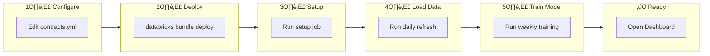
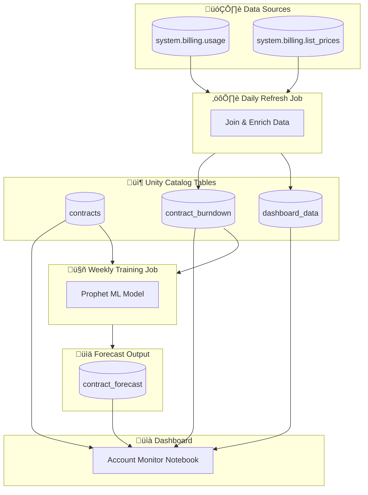
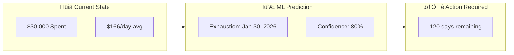

# Databricks Account Monitor

**Track consumption, forecast contract exhaustion, and manage Databricks spending**

[](https://databricks.com)
[](CHANGELOG.md)

---

## Overview

The Account Monitor is a complete solution for tracking Databricks consumption and predicting when contracts will be exhausted. It combines:

- **Real-time cost tracking** from Databricks system tables
- **ML-based forecasting** using Prophet to predict future consumption
- **Contract burndown visualization** showing historical spend and projected exhaustion dates
- **Automated refresh jobs** to keep data current

### Key Capabilities

| Feature | Description |
|---------|-------------|
| **Cost Monitoring** | Track spending across all workspaces, SKUs, and products |
| **Contract Management** | Store contract details (value, dates, cloud provider) |
| **Burndown Analysis** | Visualize cumulative spend vs contract limit |
| **ML Forecasting** | Prophet-based predictions with exhaustion dates |
| **What-If Analysis** | Discount scenario simulation with savings projections |
| **Automated Jobs** | Daily refresh, weekly training, monthly summaries |

---

## Quick Start - First Install

### One-Command Install

```bash
# 1. Configure your contracts
vi config/contracts.yml

# 2. Deploy the bundle
databricks bundle deploy --profile YOUR_PROFILE

# 3. Run the first install job (does everything)
databricks bundle run account_monitor_first_install --profile YOUR_PROFILE
```

This single job creates tables, loads contracts, populates data, and trains the ML model.

### Manual Step-by-Step (Alternative)

Complete setup in 5 steps. After this, you'll have a working dashboard with ML forecasts.



### Step 1: Configure Your Contracts

Edit `config/contracts.yml` with your contract details:

```yaml
account_metadata:
  account_id: "auto"                    # Auto-detect from billing
  customer_name: "Your Organization"

contracts:
  - contract_id: "MY-CONTRACT-001"
    cloud_provider: "auto"              # Auto-detect (AWS/Azure/GCP)
    start_date: "auto"                  # Or specific date: "2025-01-01"
    end_date: "auto"                    # Or specific date: "2025-12-31"
    total_value: 50000.00               # Your contract commitment
    currency: "USD"
    commitment_type: "SPEND"
    status: "ACTIVE"
    notes: "Annual contract"
```

### Step 2: Deploy the Bundle

```bash
# Set your profile (replace with your actual profile name)
export PROFILE="YOUR_PROFILE"

# Deploy all resources to Databricks
databricks bundle deploy --profile $PROFILE

# If dashboard was modified in UI, use --force to overwrite
databricks bundle deploy --profile $PROFILE --force
```

### Step 3: Run Initial Setup

This creates tables and loads your contracts from the config file:

```bash
databricks bundle run account_monitor_setup --profile $PROFILE
```

**Expected output:** Schema created, contracts loaded from `contracts.yml`

### Step 4: Load Historical Data

Run the daily refresh to populate burndown data from `system.billing.usage`:

```bash
databricks bundle run account_monitor_daily_refresh --profile $PROFILE
```

**Expected output:** `dashboard_data` and `contract_burndown` tables populated

### Step 5: Train the Forecast Model

Run the weekly training job to generate ML predictions:

```bash
databricks bundle run account_monitor_weekly_training --profile $PROFILE
```

**Expected output:** Prophet model trained, `contract_forecast` table populated with exhaustion dates

### Step 6: View the Dashboard

The Lakeview dashboard is automatically deployed. Open it from:
1. **Databricks Workspace** > **Dashboards** > **Contract Consumption Monitor**

Or use the CLI:
```bash
databricks lakeview list --profile YOUR_PROFILE
```

**Dashboard Pages:**
| Page | Description |
|------|-------------|
| **Executive Summary** | Contract overview, pace status, total consumption |
| **Contract Burndown** | Cumulative spend vs commitment with ML forecast |
| **What-If Analysis** | Discount scenario comparison and savings projections |

---

## Architecture



---

## Data Model


### System Tables (Read-Only)

| Table | Description |
|-------|-------------|
| `system.billing.usage` | Raw usage records (DBUs, dates, workspaces, SKUs) |
| `system.billing.list_prices` | Pricing information per SKU and cloud |

---

## Job Schedule


| Job | Schedule | Purpose | Manual Command |
|-----|----------|---------|----------------|
| **Daily Refresh** | 2:00 AM UTC | Update consumption data | `databricks bundle run account_monitor_daily_refresh` |
| **Weekly Training** | Sunday 3:00 AM | Retrain Prophet models | `databricks bundle run account_monitor_weekly_training` |
| **Weekly Review** | Monday 8:00 AM | Contract analysis | `databricks bundle run account_monitor_weekly_review` |
| **Monthly Summary** | 1st @ 6:00 AM | Archive & reports | `databricks bundle run account_monitor_monthly_summary` |

---

## Setup

### Prerequisites

- Databricks workspace with **Unity Catalog** enabled
- Access to **system.billing** tables (account admin or granted access)
- **Databricks CLI** installed and configured
- A **SQL Warehouse** (serverless recommended)

### Step 1: Configure the Bundle

Edit `databricks.yml` with your workspace settings:

```yaml
targets:
  dev:
    workspace:
      host: https://your-workspace.cloud.databricks.com
    variables:
      warehouse_id: "your-warehouse-id"   # From SQL Warehouses page
      catalog: "main"
      schema: "account_monitoring_dev"
```

### Step 2: Configure Your Contracts

Edit `config/contracts.yml` to define your organization and contracts:

```yaml
# config/contracts.yml
account_metadata:
  account_id: "auto"                    # Auto-detect from billing data
  customer_name: "Your Organization"
  business_unit_l0: "AMER"
  account_executive: "John Doe"
  solutions_architect: "Jane Smith"
  region: "US-WEST"
  industry: "Technology"

contracts:
  - contract_id: "CONTRACT-2026-001"
    cloud_provider: "auto"              # Auto-detect (AWS/Azure/GCP)
    start_date: "2025-07-01"            # Or "auto" for 1 year ago
    end_date: "2026-06-30"              # Or "auto" for 1 year from now
    total_value: 50000.00
    currency: "USD"
    commitment_type: "SPEND"
    status: "ACTIVE"
    notes: "Annual enterprise contract"

  # Add more contracts as needed:
  - contract_id: "CONTRACT-2026-002"
    cloud_provider: "AWS"
    start_date: "2026-01-01"
    end_date: "2026-12-31"
    total_value: 100000.00
    currency: "USD"
    commitment_type: "DBU"
    status: "PENDING"
    notes: "DBU commitment for next year"
```

**Auto-detection:**
- `account_id: "auto"` → Reads from `system.billing.usage`
- `cloud_provider: "auto"` → Detects from your actual usage data
- `start_date: "auto"` → Sets to 1 year ago
- `end_date: "auto"` → Sets to 1 year from now

**Multiple Config Files:**

You can load contracts from multiple YAML files by setting the `config_files` variable:

```yaml
# In databricks.yml - set for a specific target
targets:
  dev:
    variables:
      config_files: "config/contracts.yml,config/contracts_customer_b.yml"
```

Or pass at runtime:
```bash
databricks bundle run account_monitor_first_install \
  --param config_files="config/contracts.yml,config/contracts_customer_b.yml"
```

See `config/contracts_example.yml` for a template.

### Step 3: Deploy and Setup

```bash
# Authenticate
databricks auth login --host https://your-workspace.cloud.databricks.com --profile YOUR_PROFILE

# Deploy all resources
databricks bundle deploy --profile YOUR_PROFILE

# Run setup (creates tables + loads contracts from config)
databricks bundle run account_monitor_setup --profile YOUR_PROFILE
```

### Updating Contracts Later

To add or modify contracts after initial setup:

1. Edit `config/contracts.yml`
2. Redeploy: `databricks bundle deploy --profile YOUR_PROFILE`
3. Re-run setup: `databricks bundle run account_monitor_setup --profile YOUR_PROFILE`

Or use the **Contract Management CRUD** notebook for manual changes

---

## Visualizations

### Contract Burndown Chart (Lakeview Dashboard)

The Lakeview dashboard **Contract Burndown** page shows cumulative spending with ML forecasts:

**Prophet ML Forecast Chart:**
| Series | Color | Description |
|--------|-------|-------------|
| **Historical Consumption** | Gold (#FFD700) | Actual cumulative spending to date |
| **ML Forecast (Prophet)** | Red (#FF0000) | Prophet-predicted future spending |
| **Contract Commitment** | Dark Blue (#00008B) | Horizontal line at contract limit |
| **Exhaustion: \<date\>** | White | Vertical line marking predicted exhaustion date |

The exhaustion date line shows exactly when the forecast crosses the contract commitment, with the date displayed in the legend (e.g., "Exhaustion: Jul 29, 2026").

**Contract Burndown Page Widgets:**
1. Contract Burndown - Actual Consumption Over Time
2. Contract Burndown with Prophet ML Forecast (with exhaustion line)
3. Contract Details & Status (Start Date, End Date, Value, Consumed, etc.)
4. Contract Exhaustion Prediction (Predicted Date, Days Until, Status)

### Exhaustion Prediction



**Forecast Summary Output:**
```
============================================================
FORECAST SUMMARY
============================================================
Contract ID: CONTRACT-2026-001
Contract Value: $50,000.00
Current Spend: $30,000.00
Model: prophet
Predicted Exhaustion Date: 2026-01-30
Days Remaining: 120
============================================================
```

---

## What-If Discount Simulation

The What-If simulator helps you understand how different discount levels could impact your contract consumption and extend your contract runway.

### Objectives

1. **Scenario Comparison**: Generate multiple discount scenarios (0%, 5%, 10%, 15%, 20%+) to compare savings
2. **Duration Incentives**: Show how longer contract commitments unlock higher discount rates
3. **Sweet Spot Detection**: Identify the optimal discount level based on your consumption patterns
4. **Break-Even Analysis**: Determine minimum consumption needed to justify each discount tier
5. **Exhaustion Extension**: Calculate how many additional days each discount level provides

### How It Works

```mermaid
flowchart LR
    subgraph input["📊 Inputs"]
        burndown["Contract Burndown"]
        forecast["Prophet Forecast"]
        tiers["Discount Tiers"]
    end

    subgraph simulate["🧮 Simulator"]
        scenarios["Generate Scenarios"]
        scale["Apply Discount Factor"]
        predict["Project Exhaustion"]
    end

    subgraph output["📈 Outputs"]
        comparison["Scenario Comparison"]
        sweet["Sweet Spot"]
        savings["Savings Analysis"]
    end

    input --> simulate --> output
```



The simulator:
1. Reads your historical consumption from `contract_burndown`
2. Loads Prophet forecasts from `contract_forecast`
3. Looks up maximum discount rates from `discount_tiers` based on commitment value and duration
4. Generates scenarios at each discount level (capped by tier max)
5. Calculates simulated burndown with discount applied
6. Projects new exhaustion dates for each scenario
7. Identifies the "sweet spot" (highest savings with ≥85% utilization)

### Discount Tier Configuration

Default discount tiers are based on commitment level and contract duration:

| Commitment | 1-Year | 2-Year | 3-Year |
|------------|--------|--------|--------|
| $50K - $100K | 5% | 8% | 10% |
| $100K - $250K | 10% | 15% | 18% |
| $250K - $500K | 15% | 20% | 25% |
| $500K - $1M | 20% | 25% | 30% |
| $1M - $5M | 25% | 30% | 35% |
| $5M+ | 30% | 35% | 40% |

**Customizing Tiers:**

Edit `config/discount_tiers.yml` to customize discount rates for your organization:

```yaml
# config/discount_tiers.yml
discount_tiers:
  # Custom tier example
  - tier_id: "CUSTOM_150K_1Y"
    tier_name: "Custom - 1 Year"
    min_commitment: 150000
    max_commitment: 200000
    duration_years: 1
    discount_rate: 0.12          # 12% discount
    notes: "Negotiated rate for strategic accounts"

  # Add more tiers as needed...
  - tier_id: "CUSTOM_150K_2Y"
    tier_name: "Custom - 2 Year"
    min_commitment: 150000
    max_commitment: 200000
    duration_years: 2
    discount_rate: 0.18
    notes: "2-year commitment bonus"
```

**Tier Fields:**
| Field | Required | Description |
|-------|----------|-------------|
| `tier_id` | Yes | Unique identifier (e.g., "TIER_100K_2Y") |
| `tier_name` | Yes | Human-readable name |
| `min_commitment` | Yes | Minimum contract value for this tier |
| `max_commitment` | No | Maximum contract value (null = unlimited) |
| `duration_years` | Yes | Contract duration (1, 2, or 3) |
| `discount_rate` | Yes | Discount as decimal (0.15 = 15%) |
| `cloud_provider` | No | Restrict to specific cloud (null = all) |
| `effective_date` | No | When tier becomes active |
| `expiration_date` | No | When tier expires |
| `notes` | No | Optional description |

After editing, redeploy and rerun the setup job:

```bash
databricks bundle deploy --profile YOUR_PROFILE
databricks bundle run account_monitor_setup --profile YOUR_PROFILE
```

### Example What-If Results

For a **$100,000 contract** with **1-year duration**, the simulator generates:

| Scenario | Discount | Savings to Date | Exhaustion Date | Days Extended |
|----------|----------|-----------------|-----------------|---------------|
| Baseline (No Discount) | 0% | $0 | Jul 29, 2026 | - |
| 5% Discount | 5% | $2,145 | Aug 18, 2026 | +20 |
| 10% Discount (Max for 1yr) | 10% | $4,290 | Sep 8, 2026 | +41 |
| **15% (If 2yr commit)** | 15% | $6,435 | Sep 29, 2026 | +62 |
| **18% (If 3yr commit)** | 18% | $7,722 | Oct 13, 2026 | +76 |

**Reading the results:**
- **Baseline**: Current consumption without discount
- **Regular scenarios**: What you can achieve with your current contract duration
- **"If Xyr commit" scenarios**: Potential savings if you extend to a longer contract term

### Sweet Spot Recommendation

The simulator automatically identifies the **sweet spot** - the discount level that provides maximum savings while maintaining healthy utilization (≥85%):

```
Sweet Spot Recommendation:
┌─────────────────┬────────────────────────────┬───────────┬──────────┐
│ Contract        │ Recommended Scenario       │ Savings   │ Days +   │
├─────────────────┼────────────────────────────┼───────────┼──────────┤
│ CONTRACT-2026   │ 10% Discount (Max for 1yr) │ $4,290    │ +41      │
└─────────────────┴────────────────────────────┴───────────┴──────────┘
```

### Dashboard - What-If Analysis Page

The Lakeview dashboard includes a **What-If Analysis** page with:

| Widget | Description |
|--------|-------------|
| **Scenario Comparison Table** | All scenarios ranked by savings with status indicators |
| **Scenario Burndown Chart** | Multi-line chart comparing cumulative spend across scenarios |
| **Sweet Spot Summary** | Recommended scenario per contract |
| **Longer Duration Opportunities** | Potential savings with extended commitments |

### What-If Tables

| Table | Purpose |
|-------|---------|
| `discount_tiers` | Configurable discount rates by commitment and duration |
| `discount_scenarios` | Generated scenarios for each contract |
| `scenario_burndown` | Simulated daily consumption with discount applied |
| `scenario_forecast` | Scaled Prophet predictions for each scenario |
| `scenario_summary` | Denormalized KPIs for dashboard queries |

### Running What-If Simulation

The What-If simulation runs automatically as part of:
- **First Install**: After Prophet training completes
- **Weekly Training**: After model retraining

To run manually:

```bash
# Run the full simulator notebook
databricks bundle run account_monitor_weekly_training --profile YOUR_PROFILE

# Or just refresh scenarios (SQL-only, uses existing data)
databricks workspace import-file sql/refresh_whatif_scenarios.sql /tmp/refresh.sql --profile YOUR_PROFILE
databricks sql execute --file /tmp/refresh.sql --profile YOUR_PROFILE
```

---

## Verifying Data Freshness

```sql
-- Check data freshness
SELECT
  'contract_burndown' as table_name,
  MAX(usage_date) as latest_data,
  DATEDIFF(CURRENT_DATE(), MAX(usage_date)) as days_stale
FROM main.account_monitoring_dev.contract_burndown

UNION ALL

SELECT
  'contract_forecast' as table_name,
  MAX(forecast_date) as latest_data,
  DATEDIFF(CURRENT_DATE(), MAX(created_at)) as days_stale
FROM main.account_monitoring_dev.contract_forecast;
```

**Expected Results:**
- `contract_burndown.latest_data` should be yesterday or today
- `contract_forecast` should be updated within the last 7 days

---

## Notebooks

| Notebook | Purpose |
|----------|---------|
| **account_monitor_notebook.py** | Main dashboard with all visualizations |
| **contract_management_crud.py** | Add, update, delete contracts and metadata |
| **consumption_forecaster.py** | Prophet model training and inference |
| **whatif_simulator.py** | What-If discount scenario generation |
| **post_deployment_validation.py** | Verify setup and data integrity |

### Opening the Dashboard

**Lakeview Dashboard (recommended):**
1. Navigate to **Dashboards** in your Databricks workspace
2. Open **Contract Consumption Monitor**

**Notebook (alternative):**
1. Go to **Workspace** > **Users** > **your-email** > **account_monitor** > **files** > **notebooks**
2. Open **account_monitor_notebook** and click **Run All**

---

## Troubleshooting


### Common Commands

```bash
# Check system tables have data
databricks sql -e "SELECT COUNT(*) FROM system.billing.usage WHERE usage_date >= DATE_SUB(CURRENT_DATE(), 30)"

# Run the daily refresh
databricks bundle run account_monitor_daily_refresh --profile YOUR_PROFILE

# Run forecast training
databricks bundle run account_monitor_weekly_training --profile YOUR_PROFILE

# Check job run status
databricks runs get --run-id <RUN_ID> --profile YOUR_PROFILE
```

---

## Cleanup / Start Fresh

To completely reset and start from scratch, you have several options:

### Option 1: Drop Data Only (Keep Jobs & Dashboard)

Run the cleanup job to drop all tables and views while keeping the deployed resources:

```bash
databricks bundle run account_monitor_cleanup --profile YOUR_PROFILE
```

Then re-run the first install to recreate everything:

```bash
databricks bundle run account_monitor_first_install --profile YOUR_PROFILE
```

### Option 2: Full Reset (Remove Everything)

To completely remove all deployed resources AND data:

```bash
# Step 1: Drop all tables and views
databricks bundle run account_monitor_cleanup --profile YOUR_PROFILE

# Step 2: Destroy all DAB-managed resources (jobs, dashboard, workspace files)
databricks bundle destroy --auto-approve --profile YOUR_PROFILE
```

To redeploy after a full reset:

```bash
databricks bundle deploy --profile YOUR_PROFILE
databricks bundle run account_monitor_first_install --profile YOUR_PROFILE
```

### What Gets Removed

| Command | Tables | Views | Jobs | Dashboard | Notebooks |
|---------|--------|-------|------|-----------|-----------|
| `account_monitor_cleanup` | Yes | Yes | No | No | No |
| `bundle destroy` | No | No | Yes | Yes | Yes |
| Both commands | Yes | Yes | Yes | Yes | Yes |

---

## File Structure

```mermaid
flowchart LR
    subgraph root["📁 Root"]
        readme["README.md"]
        dbconfig["databricks.yml"]
    end

    subgraph configdir["📝 config/"]
        contracts["contracts.yml"]
        tiers["discount_tiers.yml"]
    end

    subgraph notebooks["📓 notebooks/"]
        monitor["account_monitor_notebook.py"]
        crud["contract_management_crud.py"]
        forecast["consumption_forecaster.py"]
        setupnb["setup_contracts.py"]
    end

    subgraph sql["🗃️ sql/"]
        setup["setup_schema.sql"]
        refresh["refresh_*.sql"]
    end

    subgraph resources["⚙️ resources/"]
        jobs["jobs.yml"]
    end

    root --> configdir
    root --> notebooks
    root --> sql
    root --> resources
    configdir -->|"loaded by"| setupnb
```



```
databricks_conso_reports/
├── databricks.yml              # Bundle configuration
├── README.md                   # This file
├── config/
│   ├── contracts.yml           # 📝 YOUR CONTRACT CONFIGURATION
│   └── discount_tiers.yml      # 💰 DISCOUNT TIER CONFIGURATION
├── notebooks/
│   ├── account_monitor_notebook.py    # Main dashboard
│   ├── contract_management_crud.py    # CRUD operations
│   ├── consumption_forecaster.py      # ML forecasting
│   ├── whatif_simulator.py            # What-If discount scenarios
│   ├── setup_contracts.py             # Config loader
│   └── post_deployment_validation.py  # Setup verification
├── sql/
│   ├── setup_schema.sql               # Create all tables
│   ├── refresh_dashboard_data.sql     # Daily data refresh
│   ├── refresh_contract_burndown.sql  # Burndown calculation
│   ├── build_forecast_features.sql    # ML feature prep
│   ├── create_whatif_schema.sql       # What-If simulation tables
│   ├── populate_discount_tiers.sql    # Default discount tier config
│   ├── refresh_whatif_scenarios.sql   # Refresh scenario calculations
│   ├── cleanup_schema.sql             # Drop all tables/views (reset)
│   └── validate_first_install.sql     # Installation validation
├── resources/
│   └── jobs.yml                       # Job definitions (includes first_install)
└── docs/
    └── user-guide/
        └── USER_GUIDE.md              # Detailed documentation
```

---

## Version History

| Version | Date | Changes |
|---------|------|---------|
| **1.10.0** | 2026-02-07 | What-If discount simulation with tier-based scenarios and sweet spot detection |
| **1.9.0** | 2026-02-06 | Simplified dashboard (2 pages), optimized bundle sync config |
| **1.8.0** | 2026-02-05 | Added Quick Start first-install guide with step-by-step workflow |
| **1.7.0** | 2026-02-05 | Added Prophet ML forecasting, exhaustion predictions |
| **1.6.1** | 2026-02-04 | Removed salesforce_id, added notes column |
| **1.5.0** | 2026-02-01 | Initial stable release |

---

## Quick Reference

```bash
# FIRST TIME INSTALL (does everything in one job)
databricks bundle deploy --profile YOUR_PROFILE
databricks bundle run account_monitor_first_install --profile YOUR_PROFILE

# ONGOING OPERATIONS
# Refresh data manually
databricks bundle run account_monitor_daily_refresh --profile YOUR_PROFILE

# Retrain forecast models
databricks bundle run account_monitor_weekly_training --profile YOUR_PROFILE

# Deploy changes after editing config (use --force if dashboard was modified in UI)
databricks bundle deploy --profile YOUR_PROFILE --force

# Check job status
databricks jobs list --profile YOUR_PROFILE
```

---

**Need more details?** See the [Complete User Guide](docs/user-guide/USER_GUIDE.md)
